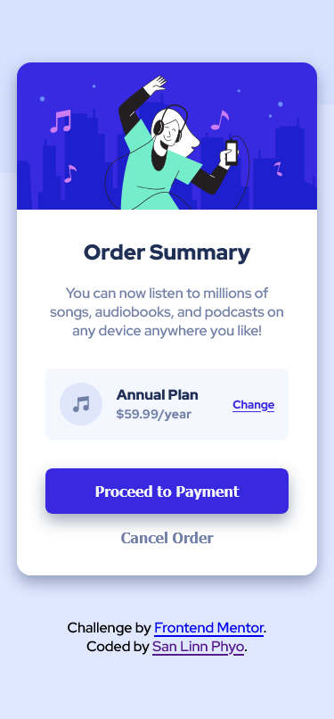
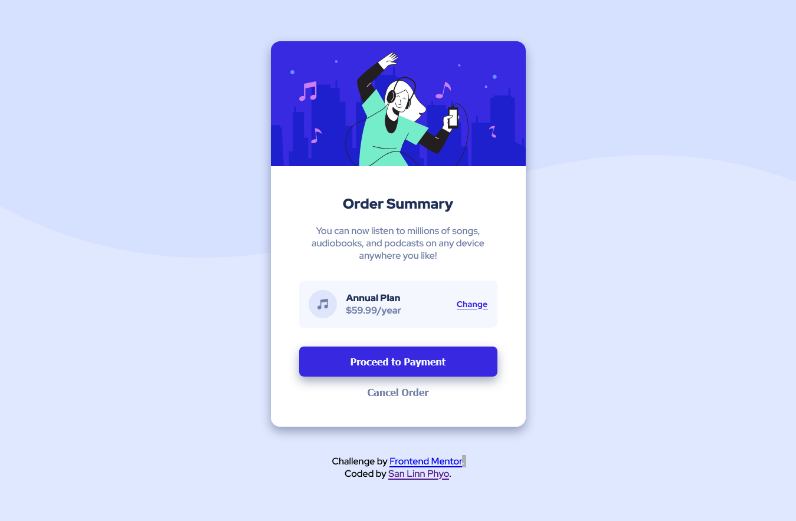

# Frontend Mentor - Order summary card solution

This is a solution to the [Order summary card challenge on Frontend Mentor](https://www.frontendmentor.io/challenges/order-summary-component-QlPmajDUj). Frontend Mentor challenges help you improve your coding skills by building realistic projects.

## Table of contents

- [Overview](#overview)
  - [The challenge](#the-challenge)
  - [Screenshot](#screenshot)
  - [Links](#links)
  - [Built with](#built-with)
  - [What I learned](#what-i-learned)
  - [Continued development](#continued-development)
- [Author](#author)

## Overview

### The challenge

Users should be able to:

- See hover states for interactive elements

### Screenshot

;
;

### Links

- Solution URL: [Solution ](https://github.com/sanlinnphyo1006/orderSummaryComponent)
- Live Site URL: [Live Site](https://sanlinnphyo1006.github.io/orderSummaryComponent/)

### Built with

- Semantic HTML5 markup
- BEM
- CSS custom properties
- Flexbox
- CSS Grid
- Mobile-first workflow

### What I learned

For me, it is difficult to maintain code and write semantically. So I searched on Google and I found BEM. BEM is a naming methodology and extends for Block, Element and Modifier.In BEM, we built html elements as blocks, elements and modifiers. Below I put some snippets of html and css...

```html
<section class="card">
  <div class="card__content">
    <h1 class="card__title">Order Summary</h1>
  </div>
</section>
```

```css
.card {
  width: 90%;
  max-width: 30rem;
  margin: auto;
  border-radius: 1rem;
  overflow: hidden;
  box-shadow: 0 0.5rem 1rem 0 var(--boxShadowClr);
}

.card__content {
  padding: 2rem;
  text-align: center;
  color: var(--darkBlue);
  background: var(--white);
}

.card__title {
  margin-top: 0;
}
```

I think BEM is useful for me. But I am not still comfortable with it.

### Continued development

I continue learning in BEM (Naming Methodology) because I am not comfortable with it. And I will also learn to write clean code, Javascript, Bootstrap, Sass and React.

## Author

You can find me on

- Github - [sanlinnphyo1006](https://github.com/sanlinnphyo1006)
- Frontend Mentor - [San Linn Phyo](https://www.frontendmentor.io/profile/sanlinnphyo1006)
- Facebook - [San Linn Phyo](https://web.facebook.com/sanlinn.phyo.50/)
